# Proyecto 2 - Sistema de Logging con ELK Stack

Pablo Andrés Zamora Vásquez - 21780
Diego Andrés Morales Aquino - 21762
Erick Stiv Junior Guerra - 21781
**Fecha**: 25/11/2025  

---

## 📋 Índice

1. [Resumen Ejecutivo](#resumen-ejecutivo)
2. [Paso 1: Juice Shop Básico](#paso-1-juice-shop-básico)
3. [Paso 2: Elasticsearch](#paso-2-elasticsearch)
4. [Paso 3: Kibana](#paso-3-kibana)
5. [Paso 4: Filebeat](#paso-4-filebeat)
6. [Paso 5: Visualización en Kibana](#paso-5-visualización-en-kibana)
7. [Paso 6: Blue Team & Red Team](#paso-6-blue-team--red-team)
8. [Análisis Técnico](#análisis-técnico)
9. [Problemas y Soluciones](#problemas-y-soluciones)
10. [Conclusiones](#conclusiones)

---

## Resumen Ejecutivo

### Descripción del Proyecto
[Describe en 2-3 párrafos qué es el proyecto, qué tecnologías usaste y qué lograste]

### Objetivos Cumplidos
- [x] Sistema ELK Stack completamente funcional
- [x] Logs recolectándose en tiempo real
- [x] Visualizaciones y dashboards creados
- [x] 3 reglas de detección configuradas
- [x] 4 vulnerabilidades explotadas y documentadas

### Tecnologías Utilizadas
- Docker y Docker Compose
- OWASP Juice Shop
- Elasticsearch 8.11.0
- Kibana 8.11.0
- Filebeat 8.11.0

### Tiempo Invertido
| Paso | Tiempo Real |
|------|-------------|
| Paso 1: Juice Shop | 15 min |
| Paso 2: Elasticsearch | 10 min |
| Paso 3: Kibana | 15 min |
| Paso 4: Filebeat | 10 min |
| Paso 5: Visualización | 20 min |
| Paso 6: Blue/Red Team | 240 min |
| Documentación | 60 min |
| **TOTAL** | **6.16 horas** |

---

## Paso 1: Juice Shop Básico

### Objetivo
Levantar el código Javascript del proyecto Juice Shop de OWASP mediante un contenedor de Docker.

### Comandos Ejecutados

```bash
# Comando 1
docker compose up -d
```

```bash
# Comando 2
docker compose ps
```

[Continúa con todos los comandos...]

### Screenshots

#### Screenshot 1.1: Docker Compose PS
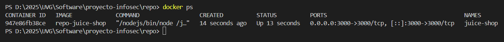

**Descripción**: Estado del contenedor "juice-shop" en Docker

**Verificación**:
- [x] Contenedor en estado "Up"
- [x] Sin errores

#### Screenshot 1.2: Navegador en http://localhost:3000
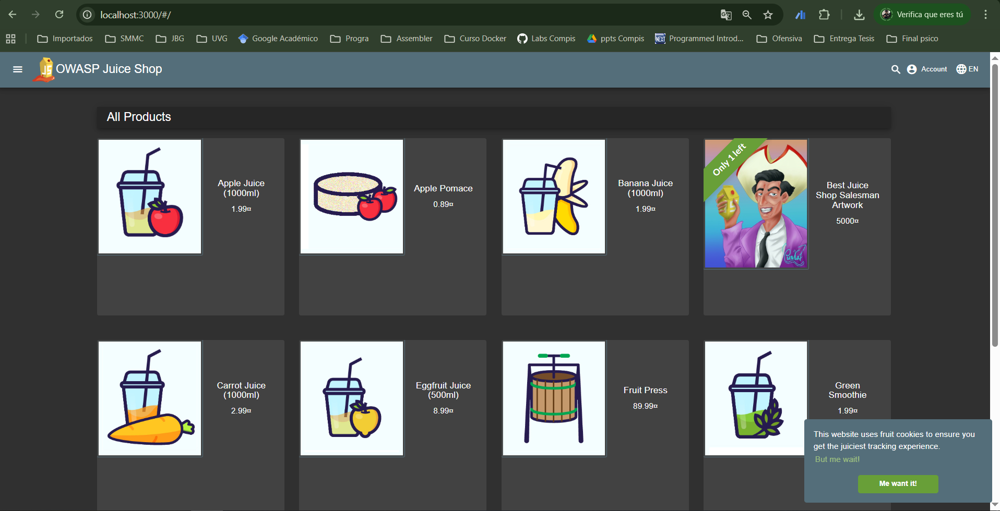

**Descripción**: Interaz de usuario de Juice Shop al acceder a localhost:3000

**Verificación**:
- [x] Interfaz renderiza correctamente

#### Screenshot 1.3: Terminal con curl http://localhost:3000
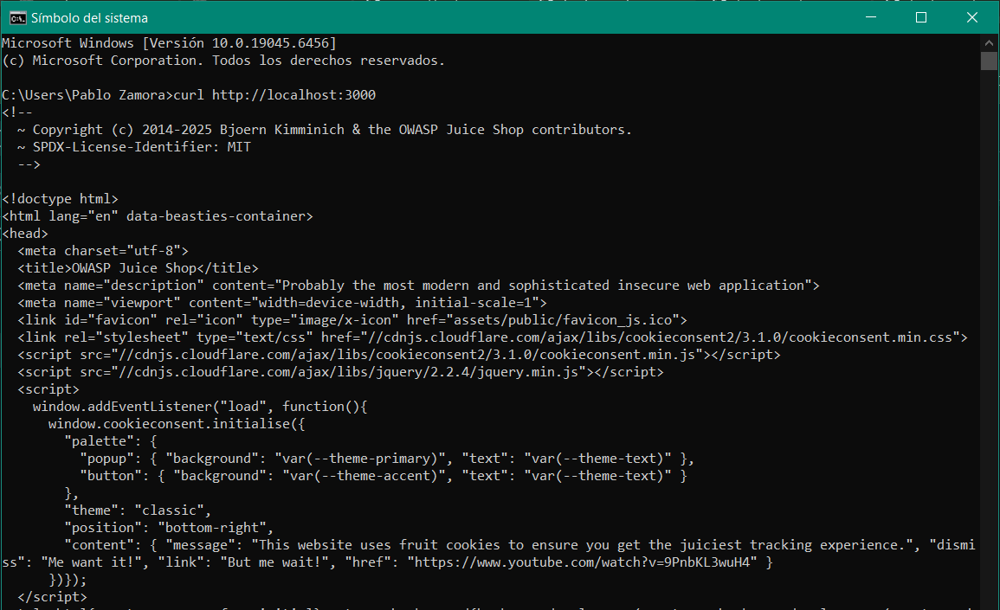

**Descripción**: CURL realizado a localhost en el puerto sobre el que se está ejecutando Juice Shop

**Verificación**:
- [x] CURL devuelve el HTML esperado

#### Screenshot 1.4: Terminal con logs
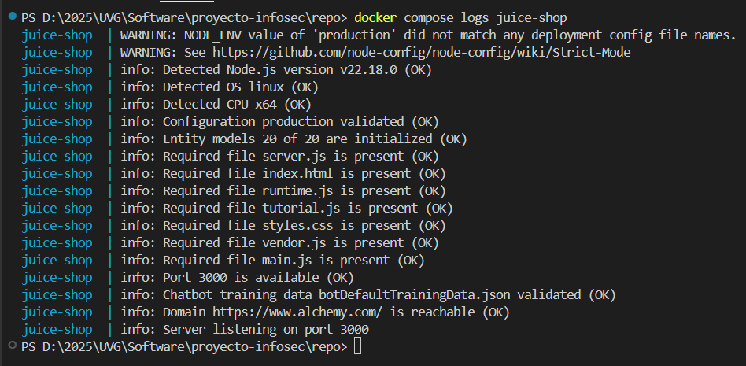

**Descripción**: Logs del contenedor de Docker

**Verificación**:
- [x] Log de servidor ejecutándose correctamente en el puerto 3000
- [x] Sin errores

### Verificación de Éxito
- [x] Contenedor corriendo sin errores
- [x] Puerto 3000 accesible
- [x] Interfaz web funcional
- [x] Logs generándose
- [x] 4 screenshots capturados

### Conceptos Aprendidos
1. **Docker Compose**: [Explica qué aprendiste]
2. **Port Mapping**: [Explica qué aprendiste]
3. **Container Logs**: [Explica qué aprendiste]

---

## Paso 2: Elasticsearch

### Objetivo
Agregar Elasticsearch como motor de almacenamiento de logs.

### Comandos Ejecutados

```bash
# Comando 1
docker compose up -d
```

```bash
# Comando 2
docker compose ps
```

```bash
# Comando 3
curl http://localhost:9200/_cluster/health?pretty
```

```bash
# Comando 4
curl http://localhost:9200
```

```bash
# Comando 5
curl -X POST "http://localhost:9200/test-index/_doc" \
  -H 'Content-Type: application/json' \
  -d '{
    "message": "Test log entry",
    "timestamp": "2025-11-04T10:00:00Z"
  }'
```

```bash
# Comando 6
curl "http://localhost:9200/test-index/_search?pretty"
```

```bash
# Comando 7
curl "http://localhost:9200/_cat/indices?v"
```

### Screenshots

#### Screenshot 2.1: Docker Compose PS
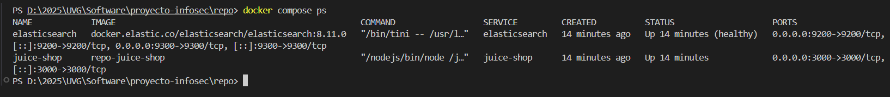

**Descripción**: Estado del contenedor "elasticsearch" en Docker

**Verificación**:
- [x] Estado del contenedor de ElasticSearch "healthy"

#### Screenshot 2.2: Salud del cluster
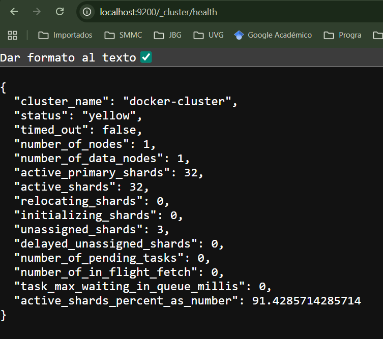

**Descripción**: Salud del Cluster

**Verificación**:
- [x] Estado "Yellow"

#### Screenshot 2.3: Información del nodo
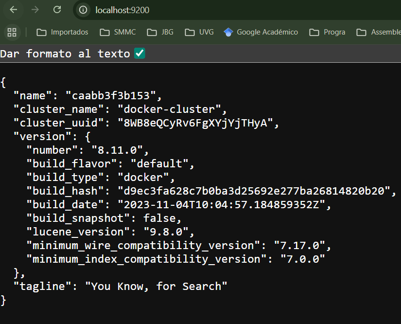

**Descripción**: Información del nodo de ElasticSearch

**Verificación**:
- [x] Puerto 9200 respondiendo

#### Screenshot 2.4: Creación de documento
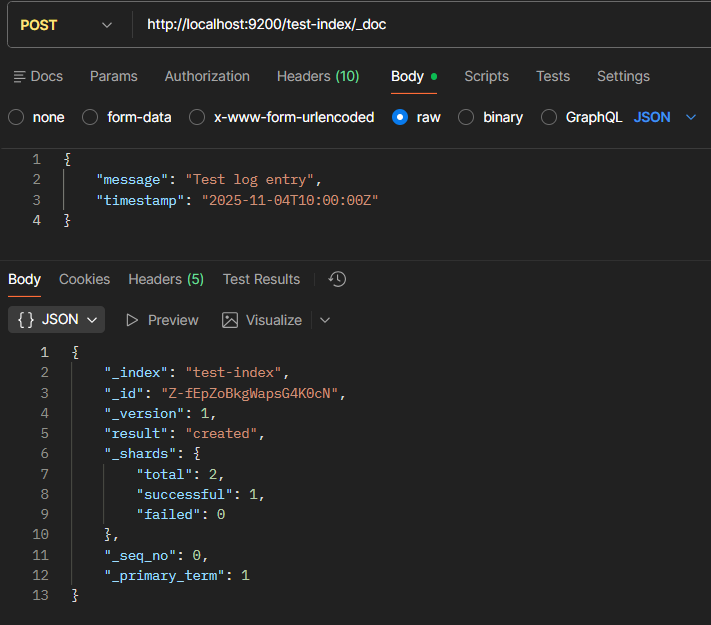
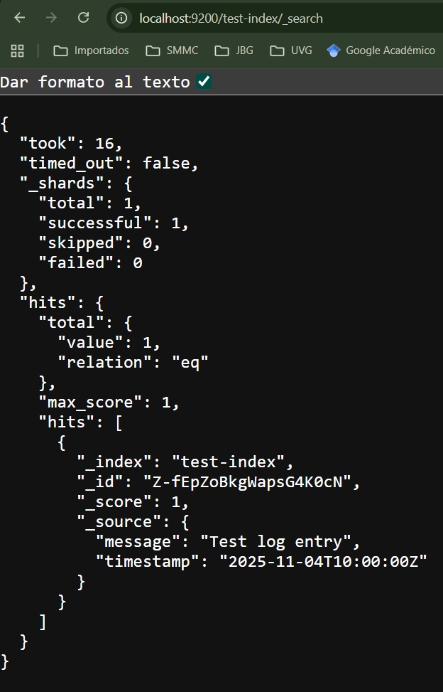

**Descripción**: Creación de un documento en un índice de prueba

**Verificación**:
- [x] Creación exitosa del documento
- [x] Respuesta del documento creado al buscarlo

#### Screenshot 2.5: Lista de índices
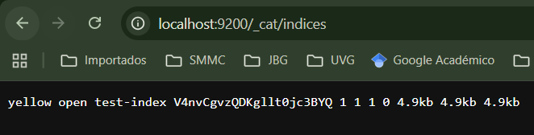

**Descripción**: Lista de índices en ElasticSearch

**Verificación**:
- [x] Índice de prueba "test-index" listado

### Verificación de Éxito
- [x] Elasticsearch corriendo y healthy
- [x] Cluster en estado GREEN/YELLOW
- [x] Puerto 9200 respondiendo
- [x] Puede crear documentos
- [x] 5 screenshots capturados

### Conceptos Aprendidos
1. **Elasticsearch**: [Explica]
2. **Índices y Documentos**: [Explica]
3. **RESTful API**: [Explica]

---

## Paso 3: Kibana

### Objetivo
Agregar Kibana como interfaz visual para Elasticsearch.

### Comandos Ejecutados

```bash
# Comando 1
docker compose up -d
```

```bash
# Comando 2
docker compose ps
```

```bash
# Comando 3
curl http://localhost:5601/api/status | jq .
```

### Screenshots

#### Screenshot 3.1: docker compose ps con los 3 servicios
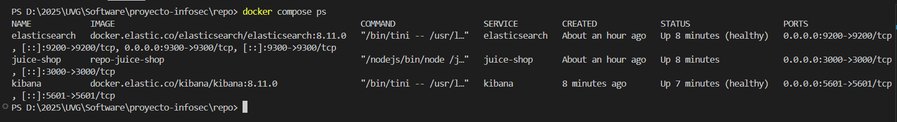

**Descripción**: Estado del contenedor "kibana" en Docker

**Verificación**:
- [x] Estado del contenedor de Kibana "healthy"

#### Screenshot 3.2: Pantalla de bienvenida de Kibana
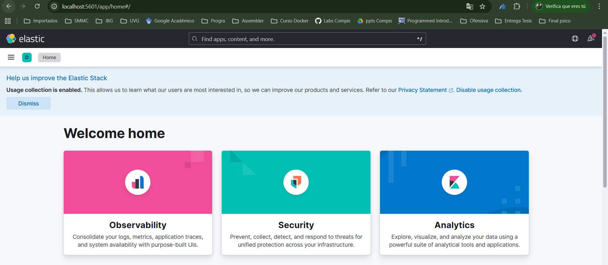

**Descripción**: Pantalla de bienvenida de la interfaz de Kibana en localhost:5601

**Verificación**:
- [x] Puerto 5601 accesible
- [x] Interfaz web funcional

#### Screenshot 3.3: Dev Tools con query GET / y respuesta
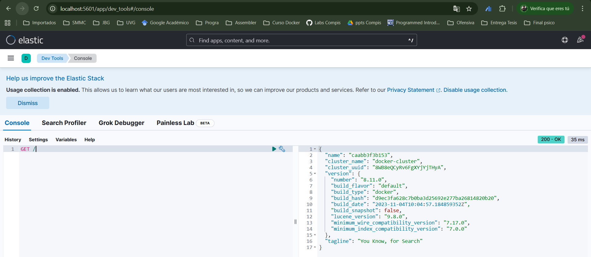

**Descripción**: Funcionamiento de las Dev Tools en la interfaz

**Verificación**:
- [x] DevTools funcionando correctamente
- [x] Respuesta correcta de GET /

#### Screenshot 3.4: Estado de Kibana
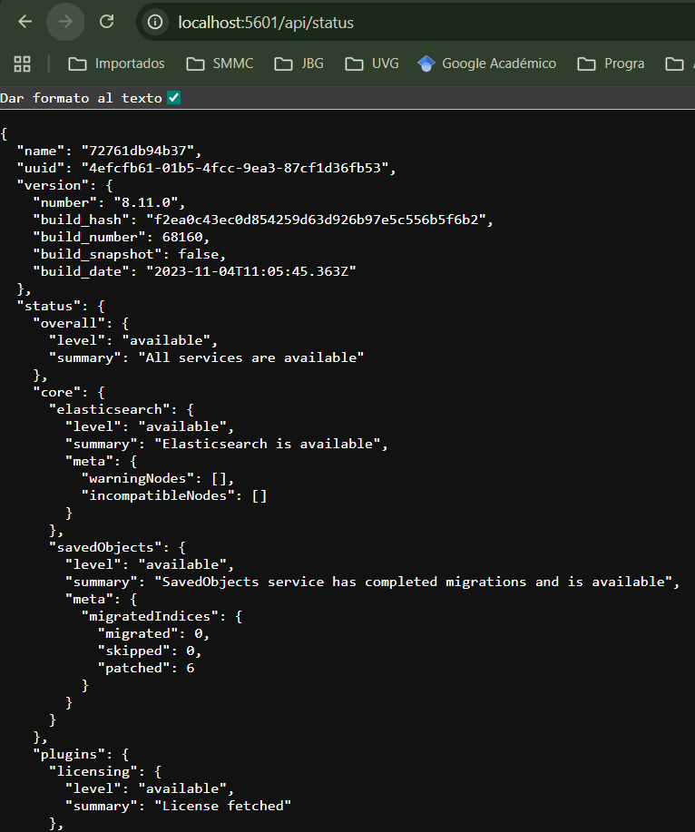

**Descripción**: Respuesta del endpoint /api/status de Kibana

**Verificación**:
- [x] Estado "available"

### Verificación de Éxito
- [x] Kibana corriendo y healthy
- [x] Puerto 5601 accesible
- [x] Conectado a Elasticsearch
- [x] Dev Tools funcional
- [x] 4 screenshots capturados

### Conceptos Aprendidos
1. **Kibana**: [Explica]
2. **Dev Tools**: [Explica]
3. **Redes Docker**: [Explica]

---

## Paso 4: Filebeat

### Objetivo
Agregar Filebeat para conectar todo el flujo de datos.

### Comandos Ejecutados


```bash
# Comando 1
docker compose up -d
```

```bash
# Comando 2
docker compose ps
```

```bash
# Comando 3
docker compose logs filebeat | grep -i "connection"
```

```bash
# Comando 4
for i in {1..20}; do 
  curl -s http://localhost:3000 > /dev/null
  echo "Request $i"
  sleep 1
done

```bash
# Comando 5
curl "http://localhost:9200/_cat/indices?v" | grep filebeat
```
```bash
# Comando 6
curl -X GET "http://localhost:9200/filebeat-juice-shop-*/_search?size=1&pretty"
```

### Screenshots

#### Screenshot 4.1: docker compose ps con los 4 servicios
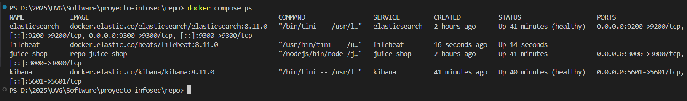

**Descripción**: Estado del conetendor "filebeat" en docker

**Verificación**:
- [x] Contenedor ejecutándose

#### Screenshot 4.2: Logs de Filebeat mostrando conexión
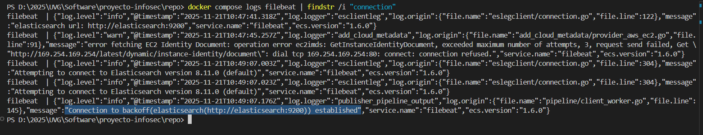

**Descripción**: Logs de Filebeat

**Verificación**:
- [x] Conexión con ElasticSearch establecida

#### Screenshot 4.3: Generación de tráfico (loop de curl)
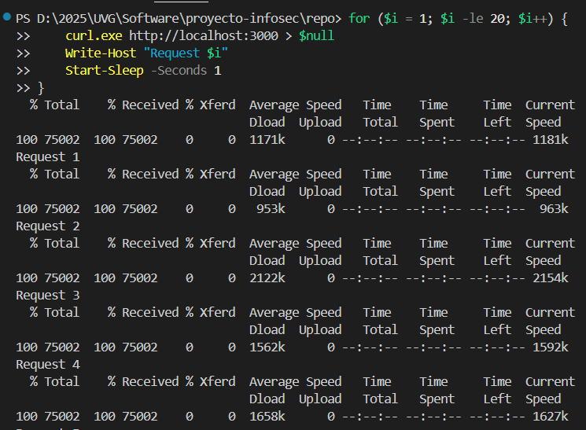

**Descripción**: Loop de solicitudes a localhost:3000 (Juice Shop) para generar tráfico

**Verificación**:
- [x] Solicitudes enviadas exitosamente

#### Screenshot 4.4: Índices filebeat-* creados
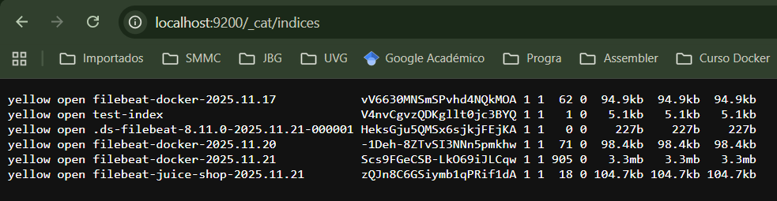

**Descripción**: Lista de índices tras el tráfico generado hacia Juice Shop

**Verificación**:
- [x] Índices filebeat-*

#### Screenshot 4.5: Documento de log completo (JSON)
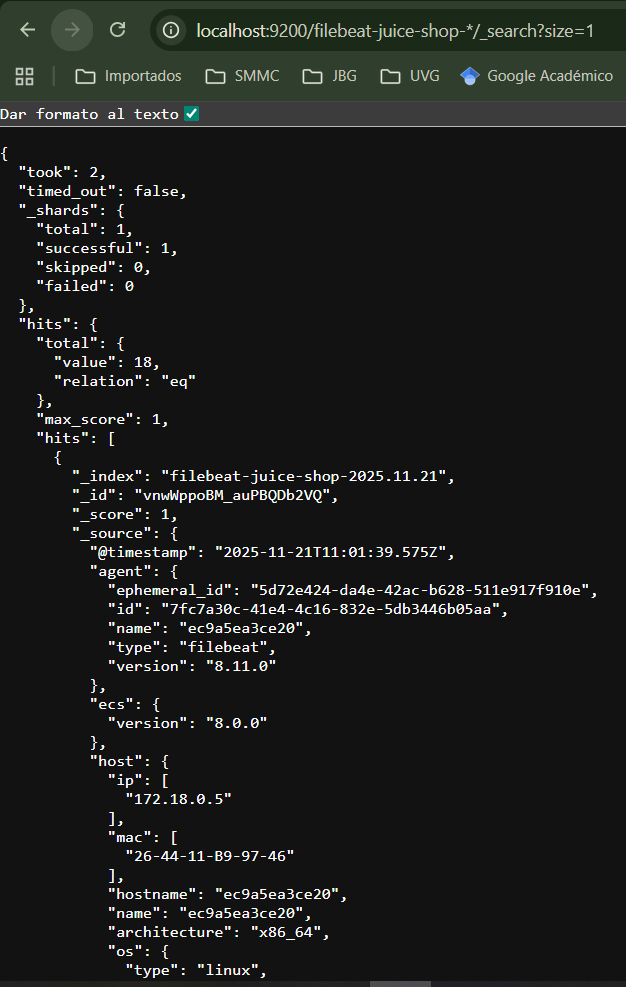

**Descripción**: Respuesta de la búsqueda de un log individual de filebeat

**Verificación**:
- [x] Log perteneciente al índice "filebeat-juice-shop-2025.11.21"

### Verificación de Éxito
- [x] Filebeat corriendo sin errores
- [x] Conectado a Elasticsearch
- [x] Índices filebeat-* creados
- [x] Logs con metadata completa
- [x] 5 screenshots capturados

### Conceptos Aprendidos
1. **Filebeat**: [Explica]
2. **Log Shipping**: [Explica]
3. **Processors**: [Explica]

---

## Paso 5: Visualización en Kibana

### Objetivo
Configurar Data Views, crear visualizaciones y armar dashboards.

### Configuraciones Realizadas

#### Data Views Creados

**Data View 1: Todos los Logs**
- Name: Todos los Logs
- Index pattern: filebeat-*
- Timestamp field: @timestamp

**Data View 1: Todos los Logs**
- Name: Todos los Logs
- Index pattern: filebeat-*
- Timestamp field: @timestamp

#### Visualizaciones Creadas

**Visualización 1: Distribución por Contenedor**
- Tipo: Pie Chart
- Segmentación: container.name.keyword
- Métrica: Conteo de registros

**Visualización 2: Volumen en el Tiempo**
- Tipo: Line Chart
- Eje horizontal: @timestamp
- Eje vertical: Conteo de registros
- Segmentación: container.name.keyword

**Visualización 3: Top 10 de mensajes de Juice Shop**
- Tipo: Tabla
- Filas: message.keyword
- Métrica: Conteo de registros

**Visualización 4: Total de logs**
- Tipo: Métrica (Legacy)
- Métrica: Conteo de registros

#### Dashboard Creado

**Nombre**: Overview de Logs del Sistema

**Visualizaciones incluidas**:
1. Gráfico circular mostrando distribución de logs por contenedor
2. Líneas de tiempo mostrando volumen de logs por contenedor
3. Tabla con los 10 mensajes más frecuentes de Juice Shop
4. Número grande mostrando total de logs

### Screenshots

#### Screenshot 5.1: Creación de Data View
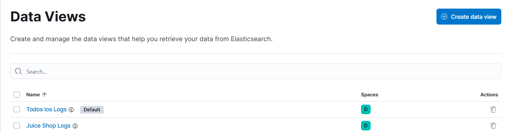

#### Screenshot 5.2: Discover mostrando logs
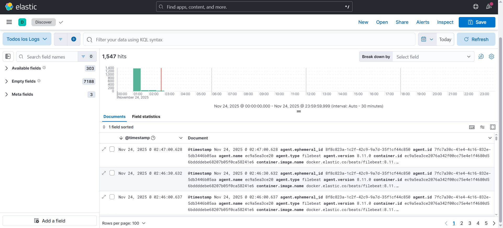

#### Screenshot 5.3: Búsqueda con KQL
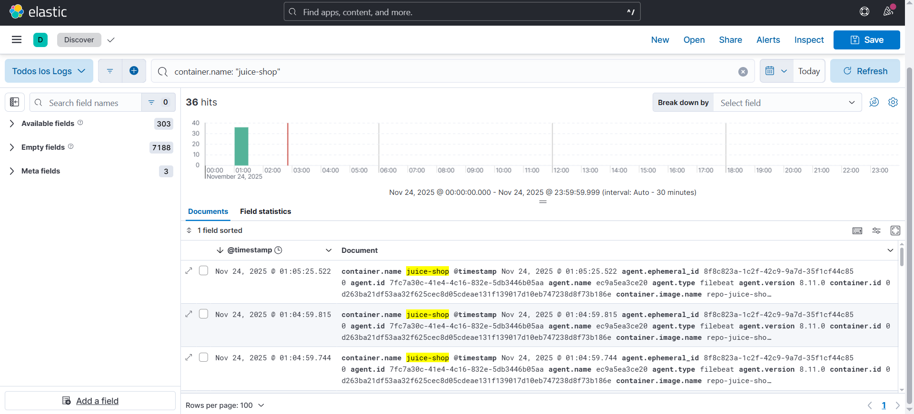
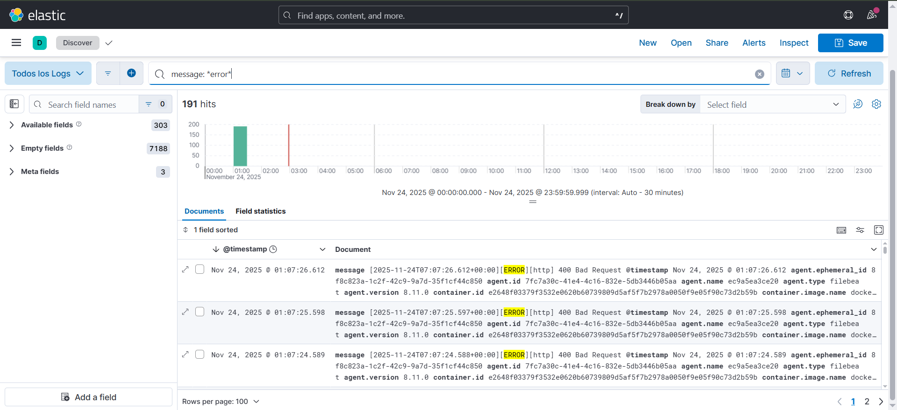
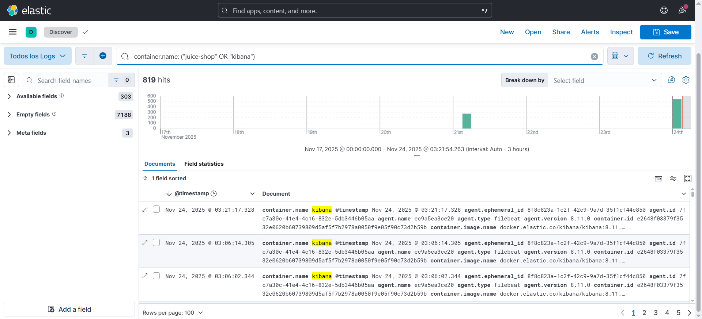

#### Screenshot 5.4: Log expandido con todos los campos
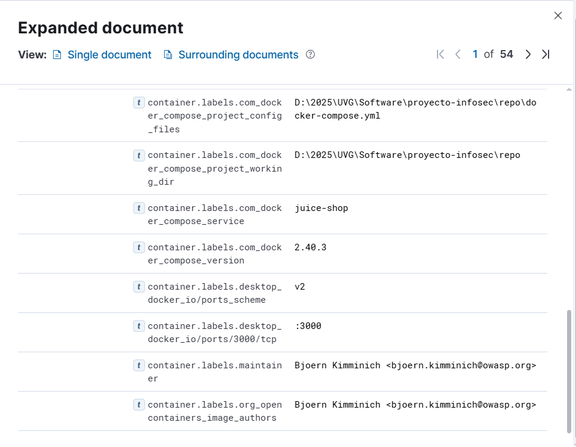

#### Screenshot 5.5: Creación de Pie Chart
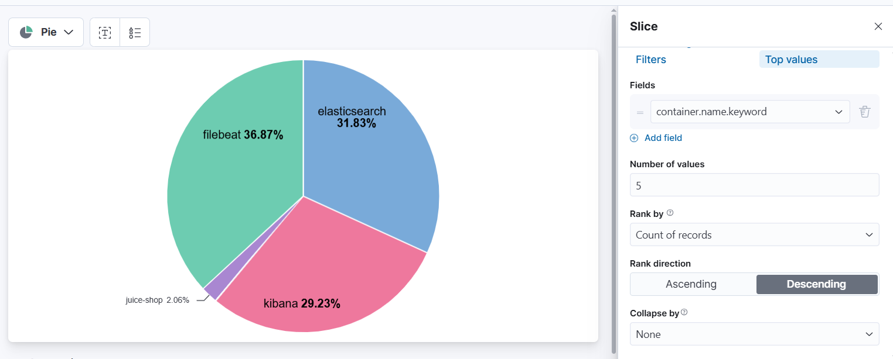

#### Screenshot 5.6: Pie Chart completado
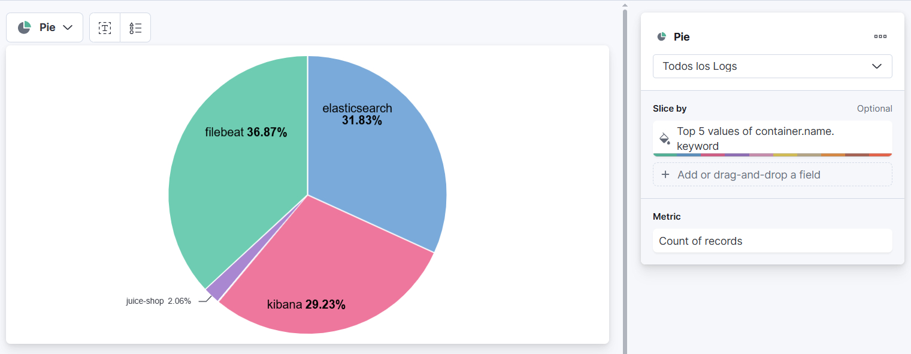

#### Screenshot 5.7: Creación de Line Chart
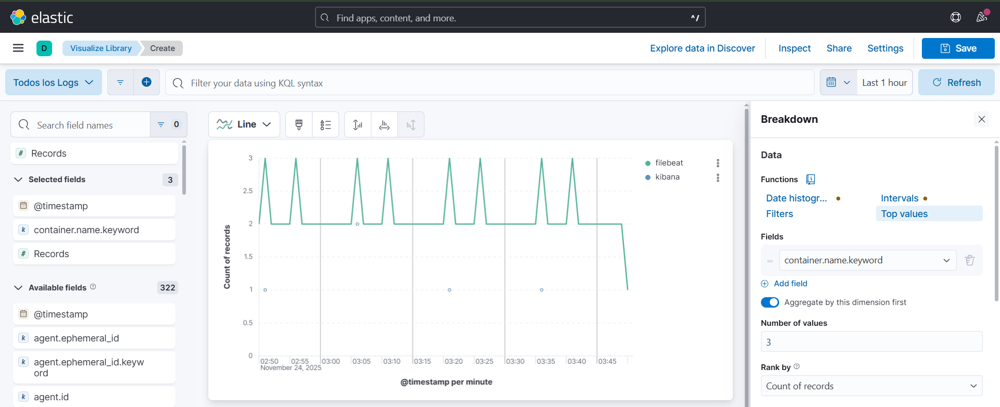

#### Screenshot 5.8: Line Chart completado
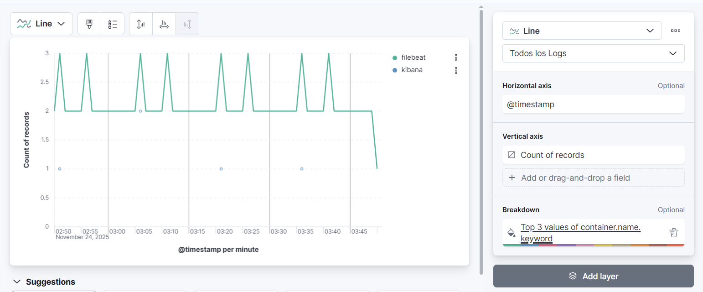

#### Screenshot 5.9: Creación de Tabla
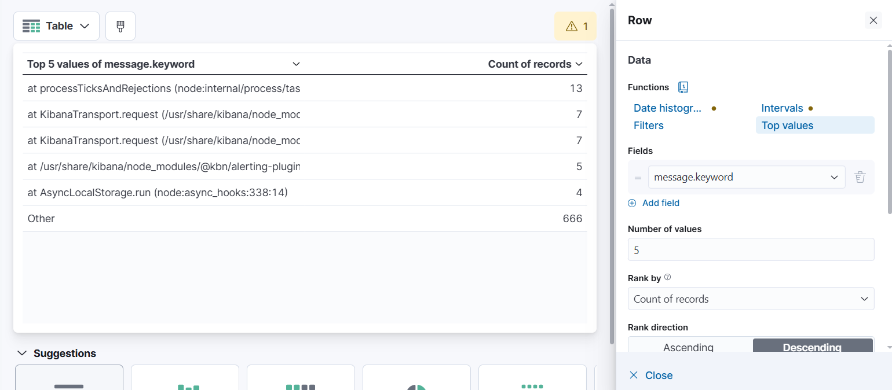

#### Screenshot 5.10: Tabla completada
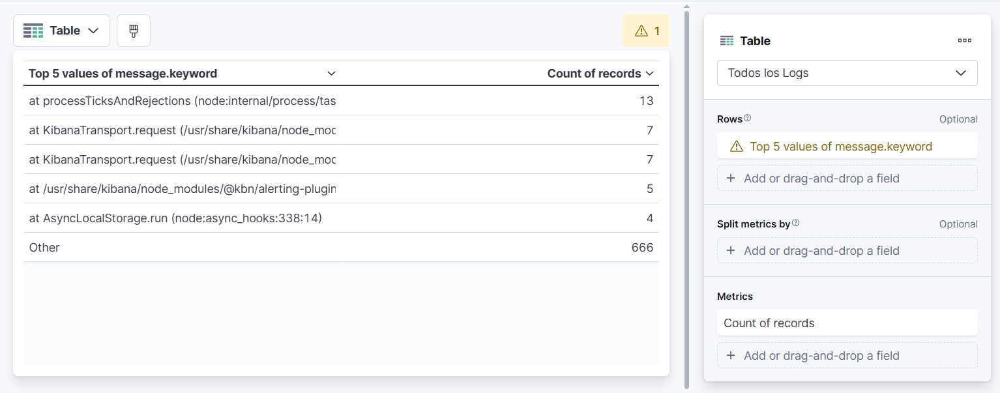

#### Screenshot 5.11: Metric completado
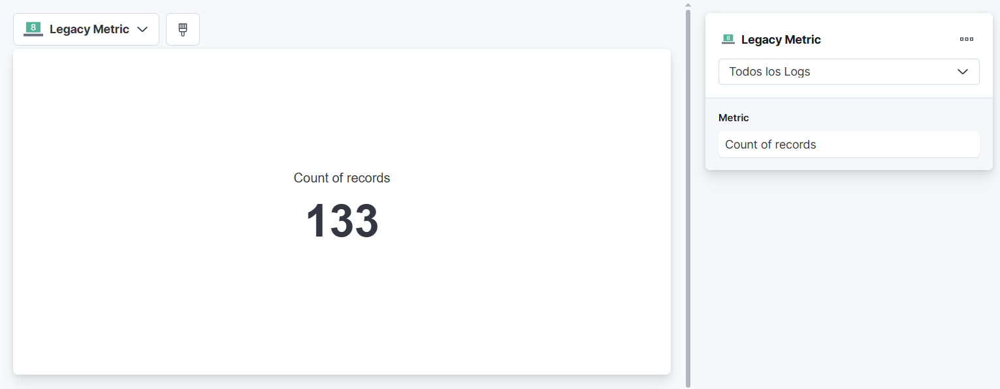

#### Screenshot 5.12: Visualize Library con las visualizaciones
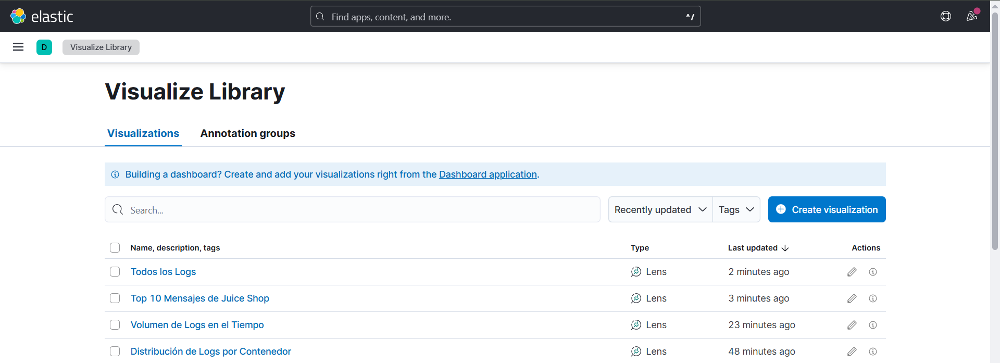

#### Screenshot 5.13: Dashboard completo


#### Screenshot 5.14: Dev Tools con query avanzada
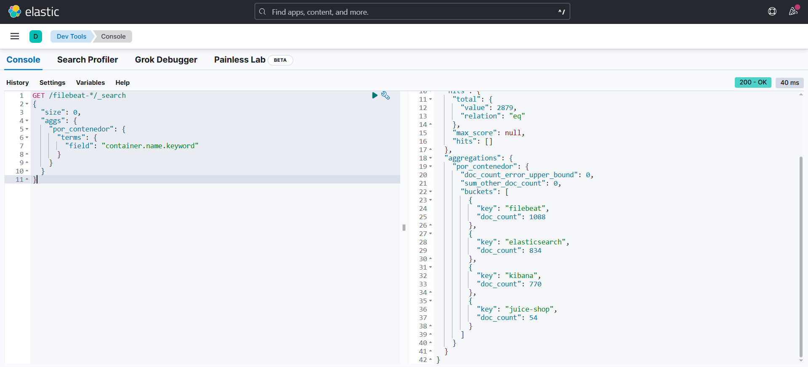

### Búsquedas KQL Utilizadas

```kql
# Búsqueda 1: Solo logs de Juice Shop
container.name: "juice-shop"
```

```kql
# Búsqueda 2: Mensajes que contienen 'error'
message: *error*
```

```kql
# Búsqueda 3: Mensajes de Juice Shop o Kibana
container.name: ("juice-shop" OR "kibana")
```

### Verificación de Éxito
- [x] Data View creado
- [x] Discover funcional
- [x] 3 visualizaciones creadas
- [x] Dashboard creado
- [x] 12 screenshots capturados

### Conceptos Aprendidos
1. **Data Views**: [Explica]
2. **KQL**: [Explica]
3. **Visualizaciones**: [Explica]
4. **Dashboards**: [Explica]

---

## Paso 6: Blue Team & Red Team

### Blue Team: Reglas de Detección

#### Regla 1: Detección de SQL Injection

**Configuración**:
- Name: Detección SQL Injection
- Type: Custom query
- Query: `request_uri: (OR or UNION or SELECT or INSERT or DROP or -- or %27 or 1=1)`
- Severity: High
- Risk score: 80

**Prueba**:
```bash
curl "http://localhost:8080/rest/products/search?q=' OR '1'='1"
```

**Resultado**:
Sí fue posible detectar el intento de ataque por SQL injection, levantando la alerta correspondiente.

**Limitaciones**:

Esta regla es muy sensible porque dispara solo por ver palabras clave de SQL en cualquier parte del request_uri. Cualquier tutorial, documentación o foro donde los usuarios hablen de consultas SQL legítimas puede generar alertas. Además, el -- se usa en muchas URLs como separador visual, no necesariamente como comentario SQL. Incluir %27 (comilla simple codificada) también puede generar ruido, porque es un carácter frecuente en textos naturales. Sin contexto de parámetros, método HTTP, destino (/rest/products/search vs /blog/...) o frecuencia por IP, la regla genera muchos falsos positivos, especialmente en sitios educativos, foros de desarrolladores o aplicaciones con contenido técnico. Es útil como primera señal, pero necesita correlación o condiciones adicionales para que sea realmente accionable.

Ejemplo de falsos positivo:

```bash
curl "/rest/products/search?q=how+to+select+the+best+product"
```


#### Regla 2: Detección de XSS

**Configuración**:
- Name: Detección SQL Injection
- Type: Custom query
- Query: `request_uri:(%3Cscript or %3Cimg or javascript or onerror or alert)`
- Severity: High
- Risk score: 75

**Prueba**:
```bash
curl "http://localhost:8080/rest/products/search?q=<script>alert('xss')</script>"
```

**Resultado**:
Fue posible detectar el intento de ataque XSS.

**Limitaciones**:

La regla es demasiado genérica, ya que salta solo por ver cadenas como javascript, alert o %3Cimg, que aparecen en contenido legítimo de desarrollo web, documentación, laboratorios y blogs, generando muchas falsas alarmas.

Además, no toma en cuenta el contexto del payload (ruta, parámetro, tipo de usuario, frecuencia o código de respuesta HTTP), ni diferencia entre campos pensados para código (como un editor de snippets) y campos normales.
Sin ese contexto, la señal de XSS es muy ruidosa. Lo ideal es combinar estas cadenas con rutas específicas de la app, parámetros sospechosos (q, search, comment, etc.) y, si se puede, con errores o comportamientos anómalos en la respuesta.

Ejemplo de falso positivo:

```bash
curl "/blog/xss?example=%3Cscript%3Ealert('test')%3C/script%3E"
```

#### Regla 3: Regla Brute Force

**Configuración**:
- Name: Detección Brute force
- Type: Custom query
- Query: `(message: (Invalid email or password or 401 or authentication failed)) or (request_uri: /rest/user/login and status: 401)`
- Severity: High
- Risk score: 70

**Prueba**:
```# Intentos fallidos de login
for i in {1..10}; do
  curl -X POST "http://localhost:8080/rest/user/login" \
  -H "Content-Type: application/json" \
  -d "{\"email\":\"admin@juice-sh.op\",\"password\":\"wrongpass$i\"}"
  sleep 1
done
```

**Resultado**:
Fue posible detectar el intento de acceso por medio de fuerza bruta.

**Limitaciones**:

La regla solo busca mensajes de error de autenticación o respuestas 401 sin agrupar por IP/usuario ni aplicar umbrales de frecuencia. Así, cualquier fallo de login aislado puede dispararla, y esos mismos mensajes pueden aparecer en contextos legítimos (por ejemplo, APIs internas).

Sin lógica de agregación como “más de N fallos de login desde la misma IP o usuario en T minutos”, habrá mucho ruido por usuarios que se equivocan, integraciones mal configuradas o pruebas. Para que indique realmente un brute force, la regla debería añadir conteos y límites por IP, usuario y ventana de tiempo.

Ejemplo de falso positivo:

Usuario que se equivoca varias veces en su email o contraseña.
```bash
curl "/rest/user/login HTTP/1.1"
```

#### Regla 3: Traffic Scanner

**Configuración**:
- Name: Detección Brute force
- Type: Custom query
- Query: `http_user_agent: (sqlmap or nmap or burp or nikto or python-requests or Nuclei or masscan or ZAP or Acunetix or Nessus)`
- Severity: medium
- Risk score: 60

**Prueba**:
```curl -A "sqlmap/1.7.2" "http://localhost:8080/rest/products/search?q=test"
```

**Resultado**:
Fue posible detectar escaneos de tráfico.

**Limitaciones**:

La regla marca como malicioso cualquier User-Agent de escaneo, aunque suela ser tráfico interno legítimo o monitorización. Además, un atacante puede cambiar fácilmente el User-Agent y evadirla. Sirve como indicio de reconocimiento automatizado, pero necesita cruzarse con horarios de mantenimiento, IP internas, listas de escaneos permitidos y otras señales para distinguir entre escaneo autorizado y ataque real.

Ejemplo de falso positivo:

Equipo interno de seguridad ejecutando un escaneo autorizado con Burp o sqlmap

```bash
GET / HTTP/1.1
User-Agent: sqlmap/1.6.12#stable
```

### Red Team: DAST

Se efectuaron tres tipos de escaneo con OWASP ZAP: automatizado, activo y manual. Asimismo, se ejecutaron las herramientas Spider y AJAX Spider, utilizando credenciales válidas de autenticación para permitirles explorar más allá de la página de inicio de sesión. Durante los escaneos se encontraron 683 URLs únicas y se realizaron 7724 peticiones:

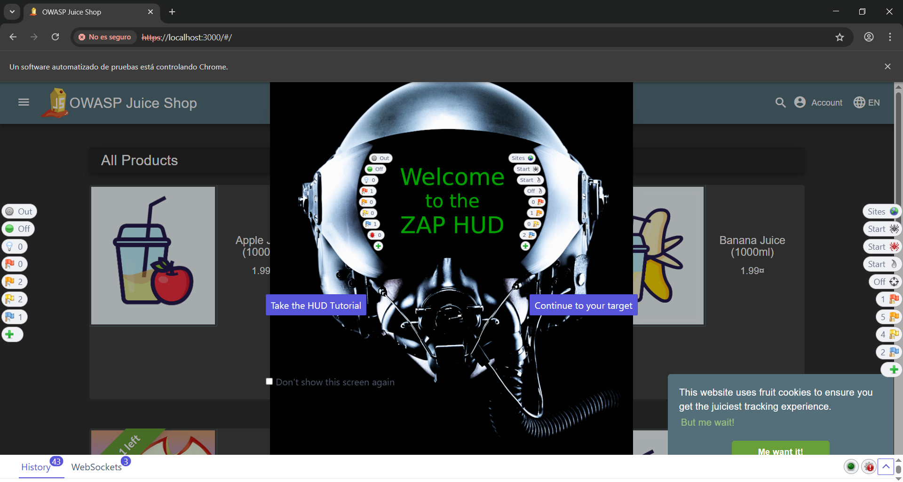
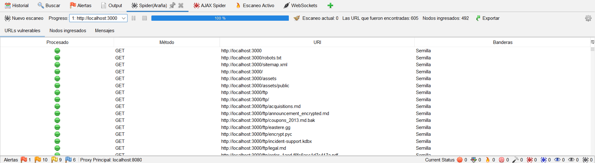
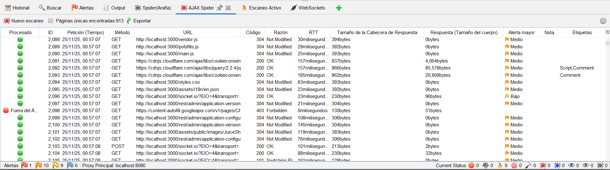
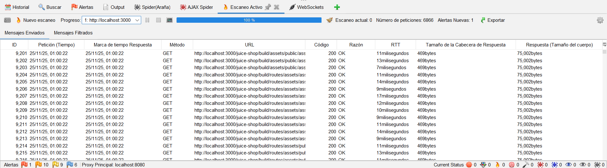

Luego de recorrer las páginas del frontend y realizar las múltiples solicitudes al backend, se encontró 1 alerta de alta prioridad, 10 de prioridad media, 9 de baja prioridad y 6 informativas.

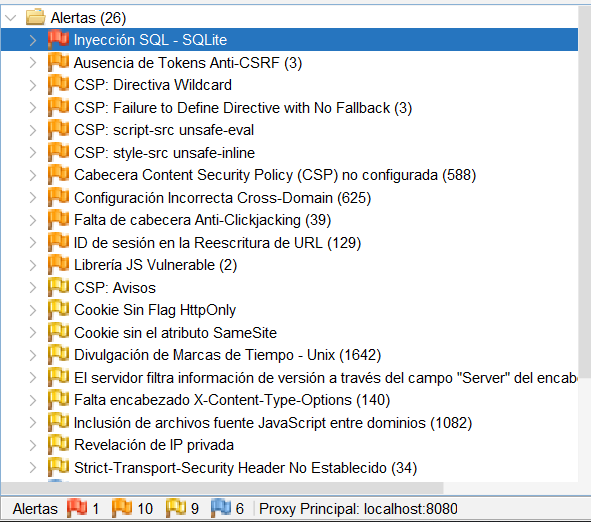

- La alerta de alta prioridad indica la posibilidad de inyección SQL (SQLi) en los endpoints `/rest/user/login` y `/rest/product/search?q=`.
- Las alertas de prioridad media indican, sobre todo, los problemas derivados de la ausencia de una Content Security Policy (CSP).
- Las alertas de baja prioridad indican las posibles vulnerabilidades debido a problemas con encabezados ausentes en las solicitudes, cookies mal configuradas y archivos de código fuente expuestos.

### Red Team: Vulnerabilidades Explotadas

#### Vulnerabilidad 1: Exposición de rutas

**Descripción Técnica**:

Debido a que el *frontend* de Juice Shop es una *Single Page Application* (SPA), herramientas como *dirbuster* o *gobuster*
no resultan del todo útiles para encontrar todas las rutas que ofrece la aplicación, ya que las SPAs usualmente cuentan
con un *fallback* de ruteo; es decir, si una ruta especificada por el usuario no está definida, se redirige a una página
por defecto, haciendo que cualquier ruta que se pruebe durante el reconocimiento retorne un estatus "200 OK".
Por suerte, el código fuente de Juice Shop (main.js) parece definir todas las rutas de la aplicación.

Este comportamiento no representa un fallo de seguridad por sí mismo, pero puede facilitar el reconocimiento durante una
fase de enumeración, permitiendo a un atacante descubrir funcionalidades o rutas del frontend más fácilmente.

**Pasos para Reproducir**:
1. Ingresar a la interfaz gráfica de Juice Shop desde el navegador.
2. Capturar el tráfico de solicitudes con las DevTools del navegador o con BurpSuite.
3. Recargar la página y buscar el archivo "main.js" dentro de las respuestas.
4. Buscar la sección de código en la que se definen las rutas que soporta la aplicación.

**Impacto**:
- **Confidencialidad**: 🟢 BAJO - Solo revela rutas del frontend, no datos sensibles.
- **Integridad**: 🟢 BAJO - No permite modificar información.
- **Disponibilidad**: 🟢 BAJO - No afecta el rendimiento ni provoca denegación de servicio.

**Clasificación**:
- **CWE**: CWE-200: Information Exposure
- **OWASP Top 10**: A01:2021 - Broken Access Control
- **CVSS v3.1**: 3.1 (Low)
- **Vector**: CVSS:3.1/AV:N/AC:L/PR:N/UI:N/S:U/C:L/I:N/A:N

**Cálculo CVSS**:
- **AV:N** (Attack Vector: Network) - Se explota desde el navegador sin acceso local.
- **AC:L** (Attack Complexity: Low) - Basta abrir main.js.
- **PR:N** (Privileges Required: None) - No requiere autenticación.
- **UI:N** (User Interaction: None) - No requiere interacción adicional.
- **C:L** (Confidentiality: Low) - Exposición mínima de información no sensible.
- **I:N** (Integrity: None) - No se altera información.
- **A:H** (Availability: None) - No afecta disponibilidad.

**Screenshots**:

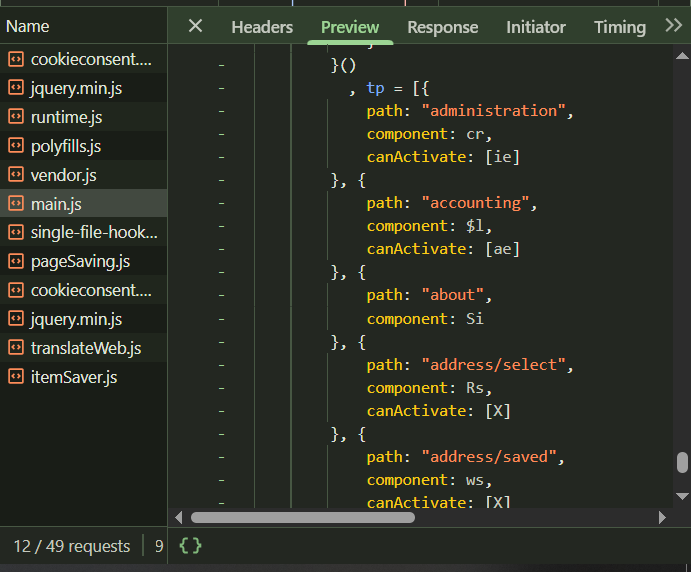

#### Vulnerabilidad 2: SQL Injection en Login

**Descripción Técnica**:

SQL Injection es una vulnerabilidad que ocurre cuando una aplicación web construye consultas SQL concatenando directamente la entrada proporcionada por el usuario sin validación ni sanitización adecuada.
Esto permite que un atacante inserte fragmentos de código SQL malicioso para:

- Alterar la lógica de autenticación
- Consultar o modificar información sensible
- Otener acceso no autorizado,
- Comprometer toda la base de datos.

La página de Login de Juice Shop presenta esta vulnerabilidad. Al navegar por todo el sitio utilizando el proxy de Burp Suite
se capturó la llamada al endpoint `/rest/user/login`, el cual únicamente recibe el correo electrónico y contraseña del usuario
en el cuerpo de la solicitud. Al inyectar SQL en el primero de estos campos, fue posible iniciar sesión como administrador.

**Endpoint Vulnerable**: `/rest/user/login`

**Pasos para Reproducir**:
1. Utilizar BurpSuite (o dirigirse a la página de Login de la interfaz de usuario) e ingresar el payload `' OR 1=1--` en el
campo de "email".
2. El contenido del campo "password" es indiferente.
3. Enviar la solicitud (o presionar el botón de "Iniciar sesión").
4. La respuesta a la solicitud enviada será un token válido para el usuario administrador. Este puede usarse para interactuar
con endpoints protegidos. En caso de enviar este payload desde la interfaz de usuario, la aplicación redigirá automáticamente
a la página principal.

**Payload Utilizado**:
```bash
curl -X POST http://localhost:3000/rest/user/login \
  -H "Content-Type: application/json" \
  -d '{
    "email": "'\'' OR 1=1--",
    "password": "anything"
  }'
```

**Response Obtenida**:
```json
{
  "authentication":{
    "token":"eyJ0eXAiOiJKV1QiLCJhbGciOiJSUzI1NiJ9.eyJzdGF0dXMiOiJzdWNjZXNzIiwiZGF0YSI6eyJpZCI6MSwidXNlcm5hbWUiOiIjezYqNn0iLCJlbWFpbCI6ImFkbWluQGp1aWNlLXNoLm9wIiwicGFzc3dvcmQiOiIwMTkyMDIzYTdiYmQ3MzI1MDUxNmYwNjlkZjE4YjUwMCIsInJvbGUiOiJhZG1pbiIsImRlbHV4ZVRva2VuIjoiIiwibGFzdExvZ2luSXAiOiIiLCJwcm9maWxlSW1hZ2UiOiJhc3NldHMvcHVibGljL2ltYWdlcy91cGxvYWRzL2RlZmF1bHRBZG1pbi5wbmciLCJ0b3RwU2VjcmV0IjoiIiwiaXNBY3RpdmUiOnRydWUsImNyZWF0ZWRBdCI6IjIwMjUtMTEtMjQgMTY6NTU6MjIuNjAzICswMDowMCIsInVwZGF0ZWRBdCI6IjIwMjUtMTEtMjQgMTk6MzA6MzcuOTU2ICswMDowMCIsImRlbGV0ZWRBdCI6bnVsbH0sImlhdCI6MTc2NDAyOTUyM30.JpMmfOWh9pYN-YaOf4c9B2OleAUGK4kMqX6UiA7LTPGxff3wal5GBXoMO88T0waGeOZjnGX1xjzXV5sr5kymWGcoGDVOU5sF-43jS1Z95EYiE0iJ0RhOuQcoke8oCHk1AX7s0kadrIY-pe5i_dCReQGE2zj6auqdqbExoefpJ4E",
    "bid":1,
    "umail":"admin@juice-sh.op"
  }
}
```

**Impacto**:
- **Confidencialidad**: 🔴 CRÍTICO - El atacante obtiene acceso completo a una cuenta privilegiada (admin),
permitiéndole ver información de usuarios, pedidos, direcciones, tokens y archivos internos.
- **Integridad**: 🔴 CRÍTICO - Con privilegios administrativos el atacante puede modificar inventario, subir imágenes,
cambiar precios, borrar usuarios y alterar configuraciones.
- **Disponibilidad**: 🟡 MEDIO - Si bien el ataque no detiene la aplicación directamente, un atacante con rol administrador puede
eliminar datos críticos, borrar productos, deshabilitar funciones o causar corrupción lógica que impida operar.

**Clasificación**:
- **CWE**: CWE-89: Improper Neutralization of Special Elements used in an SQL Command
- **OWASP Top 10**: A03:2021 - Injection
- **CVSS v3.1**: 9.8 (Critical)
- **Vector**: CVSS:3.1/AV:N/AC:L/PR:N/UI:N/S:U/C:H/I:H/A:H

**Cálculo CVSS**:
- **AV:N** (Attack Vector: Network) - El ataque puede realizarse remotamente, enviando un request HTTP al endpoint vulnerable, sin acceso físico.
- **AC:L** (Attack Complexity: Low) - No requiere condiciones especiales, solo enviar un payload simple como ' OR 1=1--.
- **PR:N** (Privileges Required: None) - No es necesario estar autenticado; incluso un usuario anónimo puede explotar el endpoint.
- **UI:N** (User Interaction: None) - Ningún usuario legítimo debe realizar una acción para que el ataque se complete.
- **C:H** (Confidentiality: High) - Acceso total a los datos sensibles del sistema (por quedar autenticado como admin).
- **I:H** (Integrity: High) - El atacante puede modificar información crítica (productos, usuarios, inventario, configuraciones).
- **A:H** (Availability: High) - Aunque no es un ataque de DoS puro, un atacante autenticado como admin puede causar interrupciones significativas y dejar el sistema inutilizable.

**Screenshots**:

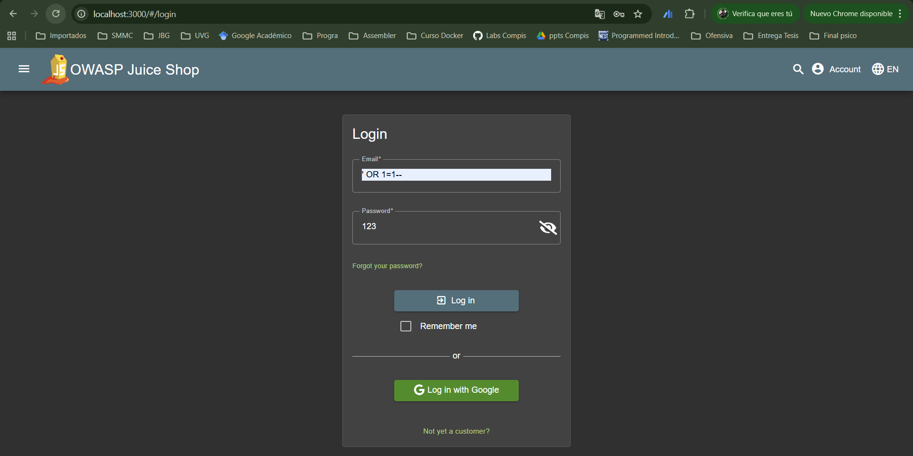
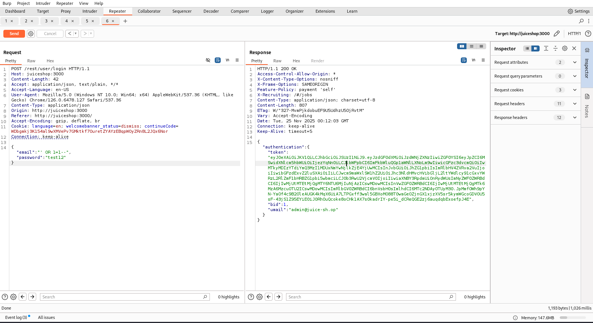
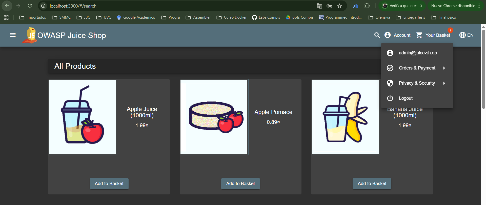

#### Vulnerabilidad 3: Cross-Site Scripting (XSS) reflejado

**Descripción Técnica**:

Cross-Site Scripting (XSS) es una vulnerabilidad que permite a un atacante inyectar código JavaScript malicioso en una aplicación web. Este código se ejecuta en el navegador de la víctima, aprovechando que la aplicación refleja o almacena contenido proporcionado por el usuario sin realizar sanitización ni escape adecuado.

En el caso de XSS reflejado (reflected XSS), la carga útil enviada por el atacante es devuelta inmediatamente en la respuesta del servidor y ejecutada en el navegador cuando la víctima accede a la URL manipulada. Juice Shop es vulnerable porque la ruta de búsqueda `/search?q=` inserta la cadena enviada por el usuario directamente en la página, sin validación.

Esto permite ejecutar JavaScript arbitrario, abrir iframes maliciosos, robar cookies o tokens JWT, e incluso redirigir al usuario a sitios externos controlados por el atacante.

**Endpoint Vulnerable**: `/rest/products/search?q=`

**Pasos para Reproducir**:
1. Acceder al cuadro de búsqueda en la página principal de Juice Shop.
2. Ingresar el payload deseado en el cuadro de búsqueda. Alternativamente, enviar la solicitud desde BurpSuite o el navegador, inyectando el payload en el *query param* "q".
3. Cuando se reciba respuesta del endpoint `rest/products/search?q=`, el código se incrustará en el DOM.
4. El navegador ejecutará el código JavaScript malicioso embebido.

**Payload Utilizado**:
```bash
<iframe src="javascript:alert('XSS ejecutado exitosamente')">
```

**Response Obtenida**:
```json
{
  "error": {
    "message": "SQLITE_ERROR: near \"XSS\": syntax error",
    "stack": "Error: SQLITE_ERROR: near \"XSS\": syntax error",
    "errno": 1,
    "code": "SQLITE_ERROR",
    "sql": "SELECT * FROM Products WHERE ((name LIKE '%<iframe src=\"javascript:alert('XSS ejecutado exitosamente')\">%' OR description LIKE '%<iframe src=\"javascript:alert('XSS ejecutado exitosamente')\">%') AND deletedAt IS NULL) ORDER BY name"
  }
}
```

**Impacto**:
- **Confidencialidad**: 🟠 MEDIO/ALTO - Permite robo de cookies o tokens JWT, lectura de información mostrada en pantalla o
envío de datos a un servidor externo.
- **Integridad**: 🟡 MEDIO - Un payload puede manipular el DOM cambiando textos, insertando botones falsos o modificando enlaces y formularios.
- **Disponibilidad**: 🟡 BAJO/MEDIO - Se podría ejecutar JavaScript que bloquee el navegador, genere loops infinitos o redireccione a un sitio externo.

**Clasificación**:
- **CWE**: CWE-79: Improper Neutralization of Input During Web Page Generation (Cross-Site Scripting)
- **OWASP Top 10**: A03:2021 - Injection
- **CVSS v3.1**: 6.1 - Medium
- **Vector**: CVSS:3.1/AV:N/AC:L/PR:N/UI:R/S:U/C:L/I:L/A:N

**Cálculo CVSS**:
- **AV:N** (Attack Vector: Network) - El ataque se ejecuta simplemente accediendo a una URL, no requiere acceso físico.
- **AC:L** (Attack Complexity: Low) - El payload es simple y no requiere condiciones especiales.
- **PR:N** (Privileges Required: None) - La vulnerabilidad es explotable por cualquier usuario anónimo.
- **UI:N** (User Interaction: Required) - La víctima debe abrir el enlace malicioso o usar el campo de búsqueda.
- **C:H** (Confidentiality: Low) - El atacante puede obtener información básica del usuario (cookies, tokens).
- **I:H** (Integrity: Low) - Puede manipular parcialmente el DOM, alterando el contenido visto por la víctima.
- **A:H** (Availability: None) - El objetivo principal no es detener la aplicación, aunque puede molestarse la navegación.

**Screenshots**:


#### Vulnerabilidad 4: Broken Access Control al cambiar contraseña

**Descripción Técnica**:

Broken Access Control se presenta cuando una aplicación no implementa adecuadamente verificaciones de permisos, identidad u operaciones sensibles. En este caso, el endpoint `/rest/user/change-password` permite modificar la contraseña del usuario sin verificar la contraseña actual, ya que dicha validación ocurre únicamente en el frontend.

Esto significa que un atacante que obtenga un token JWT (por XSS, MITM, fuga de logs, sesión robada, etc.) puede cambiar la contraseña sin necesidad de conocer la contraseña actual, lo que implica un secuestro total y permanente de la cuenta.

**Endpoint Vulnerable**: `/rest/user/change-password`

**Pasos para Reproducir**:
1. Obtener el token de sesión válido del usuario objetivo.
2. Realizar una solicitud GET (con el navegador o Burp Suite) a `/rest/user/change-password`, únicamente con los parámetros "new" y "repeat" (que deben ser iguales) con la nueva contraseña deseada.
3. El servidor omitirá la validación de la contraseña actual y actualizará la contraseña del usuario.

**Payload Utilizado**:
```bash
curl -X GET "http://localhost:3000/rest/user/change-password?new=<nueva>&repeat=<nueva>" \
  -H "Authorization: Bearer <TOKEN_VALIDO>"
```

**Response Obtenida**:
```json
{
  "user":{
    "id":23,
    "username":"",
    "email":"test@gmail.com",
    "password":"cc03e747a6afbbcbf8be7668acfebee5",
    "role":"customer",
    "deluxeToken":"",
    "lastLoginIp":"",
    "profileImage":"/assets/public/images/uploads/default.svg",
    "totpSecret":"",
    "isActive":true,
    "createdAt":"2025-11-24T18:36:38.457Z",
    "updatedAt":"2025-11-25T01:58:11.009Z",
    "deletedAt":null
  }
}
```

**Impacto**:
- **Confidencialidad**: 🟠 ALTO - Un atacante que haya obtenido un token JWT puede acceder permanentemente a la cuenta y todos sus datos privados.
- **Integridad**: 🟠 ALTO - El atacante puede cambiar la contraseña, modificar datos del usuario e impersonarlo permanentemente.
- **Disponibilidad**: 🟡 MEDIO - Aunque no es un ataque de DoS, el atacante puede bloquear al usuario legítimo de su propia cuenta e impedirle iniciar sesión al cambiar la password.

**Clasificación**:
- **CWE**: CWE-306: Missing Authentication for Critical Function y CWE-862: Missing Authorization
- **OWASP Top 10**: A01:2021 - Broken Access Control y A07:2021 - Identification and Authentication Failures
- **CVSS v3.1**: 8.8 - High
- **Vector**: CVSS:3.1/AV:N/AC:L/PR:L/UI:N/S:U/C:H/I:H/A:H

**Cálculo CVSS**:
- **AV:N** (Attack Vector: Network) - El ataque se ejecuta por HTTP.
- **AC:L** (Attack Complexity: Low) - Solo requiere enviar una solicitud manipulada.
- **PR:N** (Privileges Required: Low) - El atacante necesita un token JWT válido (rol básico).
- **UI:N** (User Interaction: None) - No requiere que la víctima haga clic o realice acciones.
- **C:H** (Confidentiality: High) - Compromiso total de la cuenta.
- **I:H** (Integrity: High) - Se modifica información sensible (la contraseña).
- **A:H** (Availability: High) - Puede bloquear al usuario legítimo al impedirle el acceso.

**Screenshots**:

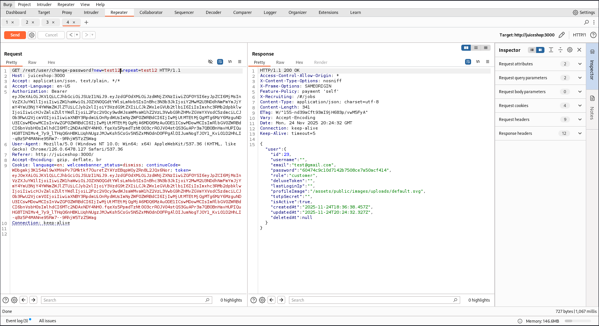

#### Vulnerabilidad 5: Broken Access Control en carrito de compras

**Descripción Técnica**:

El endpoint que permite obtener los productos que el usuario ha agregado al carrito `/rest/basket/:id` no realiza ninguna validación acerca del usuario que está realizando la solicitud y el carrito que está solicitando. Esto permite que cualquiera con un token de sesión válido pueda ver lo que otros usuarios están comprando.

**Pasos para Reproducir**:
1. Autenticarse en Juice Shop como cualquier usuario (o interceptar su token).
2. Realizar una solicitud GET al endpoint `/rest/basket/:id`, sustituyendo `id` por un ID válido de otro usuario.
3. El servidor devolverá el contenido completo del carrito del usuario solicitado, sin verificar que el usuario autenticado sea el propietario.

**Payload Utilizado**:
```bash
curl -X GET "http://localhost:3000/rest/basket/2" \
  -H "Authorization: Bearer <TOKEN_VALIDO>"
```

**Response Obtenida**:
```json
{
  "status":"success",
  "data":{
    "id":2,
    "coupon":null,
    "UserId":2,
    "createdAt":"2025-11-24T16:55:36.482Z",
    "updatedAt":"2025-11-24T16:55:36.482Z",
    "Products":[
      {
      "id":4,
      "name":"Raspberry Juice (1000ml)",
      "description":"Made from blended Raspberry Pi, water and sugar.",
      "price":4.99,
      "deluxePrice":4.99,
      "image":"raspberry_juice.jpg",
      "createdAt":"2025-11-24T16:55:35.581Z",
      "updatedAt":"2025-11-24T16:55:35.581Z",
      "deletedAt":null,
      "BasketItem":{
        "ProductId":4,
        "BasketId":2,
        "id":4,
        "quantity":2,
        "createdAt":"2025-11-24T16:55:36.748Z",
        "updatedAt":"2025-11-24T16:55:36.748Z"}
      }
    ]
  }
}
```

**Impacto**:
- **Confidencialidad**: 🟠 ALTO - El atacante puede acceder al carrito de cualquier usuario, revelando productos comprados cantidad, precios y timestamps.
- **Integridad**: 🟢 BAJO - El exploit indicado es de solo lectura.
- **Disponibilidad**: 🟢 BAJO - No es un ataque de DoS.

**Clasificación**:
- **CWE**: CWE-639: Authorization Bypass Through User-Controlled Key y CWE-862: Missing Authorization
- **OWASP Top 10**: A01:2021 Broken Access Control
- **CVSS v3.1**: 4.3 - Medium
- **Vector**: CVSS:3.1/AV:N/AC:L/PR:L/UI:N/S:U/C:L/I:N/A:N

**Cálculo CVSS**:
- **AV:N** (Attack Vector: Network) - El ataque se realiza vía HTTP.
- **AC:L** (Attack Complexity: Low) - Solo requiere cambiar el ID numérico en la URL.
- **PR:N** (Privileges Required: Low) - El atacante debe tener un token válido, pero cualquier usuario registrado puede explotar la falla.
- **UI:N** (User Interaction: None) - El ataque no requiere intervención del usuario víctima.
- **C:H** (Confidentiality: Low) - Se expone información sensible del carrito, pero no datos altamente críticos como contraseñas.
- **I:H** (Integrity: None) - El endpoint no modifica el carrito del usuario.
- **A:H** (Availability: None) - No afecta directamente la disponibilidad del sistema.

**Screenshots**:

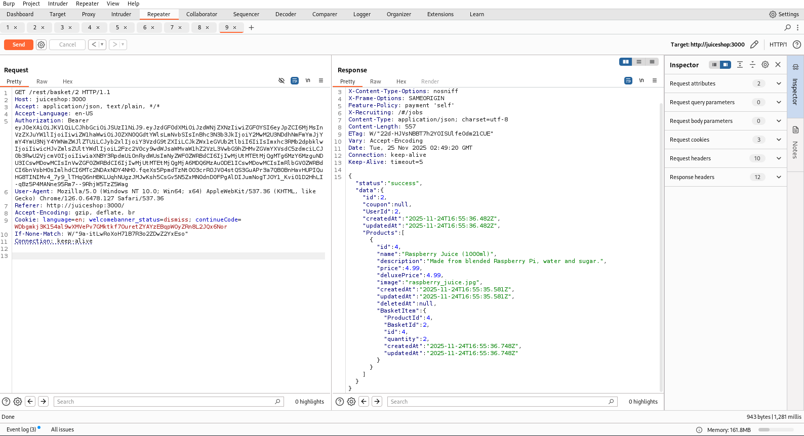
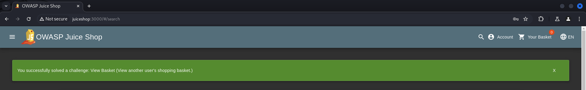

#### Vulnerabilidad 6: Improper Input Validation en carrito de compras

Improper Input Validation ocurre cuando una aplicación no valida o no restringe adecuadamente los datos que recibe antes de procesarlos. En lugar de aplicar reglas de negocio adecuadas, el backend confía en que el cliente (frontend) hará esas validaciones.

En Juice Shop, a pesar de que la interfaz de usuario del carrito de compras impide que se ingresen cantidades negativas de productos, el endpoint POST/PUT `/api/BasketItems/` acepta sin problemas valores negativos en el campo "quantity".
Esto permite manipular la lógica de cálculo del carrito y provocar montos totales negativos, que luego pueden convertirse en créditos indebidos para el usuario cuando completa la compra.

**Pasos para Reproducir**:
1. Autenticarse en Juice Shop como cualquier usuario utilizando el navegador Proxy de Burp Suite.
2. Navegar al carrito de compras y, usando Burp Suite como proxy, interceptar la solicitud PUT que se envía al agregar un producto nuevo o modificar su cantidad.
3. Modificar el campo "quantity" de la solicitud en curso a un entero negativo, por ejemplo, -10, y reenviar la solicitud modificada.
4. Alternativamente, puede enviarse directamente una solicitud POST al endpoint `/api/BasketItems/` indicando el token de sesión válido, el ID del producto, el ID del carrito y la cantidad negativa.
4. Cuando el servidor reciba la solicitud, este no validará la cantidad especificada.
5. Si se continúa con el flujo de compra, el sistema considerará la cantidad negativa, pudiendo resultar en un precio total negativo y generando crédito a favor del usuario.

**Payload Utilizado**:
```bash
curl -X POST "http://juiceshop:3000/api/BasketItems/" \
  -H "Authorization: Bearer <TOKEN_VALIDO>" \
  -H "Content-Type: application/json" \
  -d '{
    "ProductId": 1,
    "BasketId": 6,
    "quantity": -10
  }'
```

**Response Obtenida**:
```json
{
  "status": "success",
  "data": {
    "id": 11,
    "ProductId": 1,
    "BasketId": 6,
    "quantity": -10,
    "updatedAt": "2025-11-24T19:58:04.066Z",
    "createdAt": "2025-11-24T19:58:04.066Z"
  }
}
```

**Impacto**:
- **Confidencialidad**: 🟢 BAJO - No se expone información sensible de otros usuarios; el ataque se centra en manipular montos y lógica de negocio.
- **Integridad**: 🔴 CRÍTICO - El atacante puede alterar la integridad de los datos financieros: carritos con montos negativos, generación de créditos indebidos en la cuenta del usuario y posible fraude al sistema de pagos o wallet interno.
- **Disponibilidad**: 🟢 BAJO - No afecta directamente la disponibilidad del sistema, aunque un abuso masivo podría tener impacto económico para la organización.

**Clasificación**:
- **CWE**: CWE-20 - Improper Input Validation y CWE-754 - Improper Check for Unusual or Exceptional Conditions
- **OWASP Top 10**: A04:2021 - Insecure Design
- **CVSS v3.1**: 6.5 - Medium
- **Vector**: CVSS:3.1/AV:N/AC:L/PR:L/UI:N/S:U/C:N/I:H/A:N

**Cálculo CVSS**:
- **AV:N** (Attack Vector: Network) - El ataque se realiza enviando solicitudes HTTP contra la API.
- **AC:L** (Attack Complexity: Low) - Solo requiere modificar un valor numérico (quantity) en la petición.
- **PR:N** (Privileges Required: Low) - El atacante debe tener un token válido, pero cualquier usuario registrado puede explotar la falla.
- **UI:N** (User Interaction: None) - El atacante no depende de que una víctima haga algo; él mismo ejecuta el flujo.
- **C:H** (Confidentiality: None) - No se accede a datos confidenciales de otros usuarios.
- **I:H** (Integrity: High) - Se alteran reglas de negocio y montos económicos: se puede obtener dinero/crédito sin pagar.
- **A:H** (Availability: None) - No hay impacto directo en la disponibilidad del sistema.

**Screenshots**:

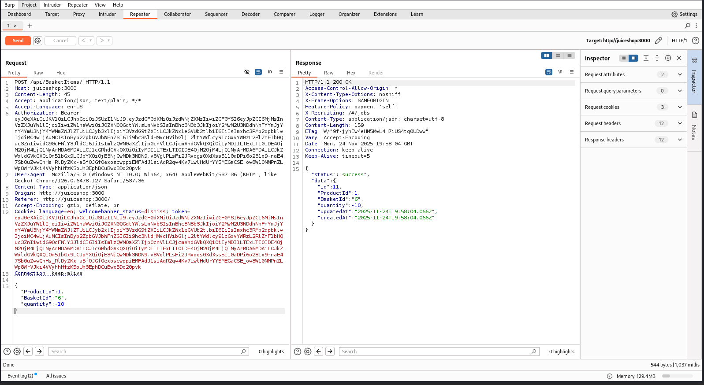
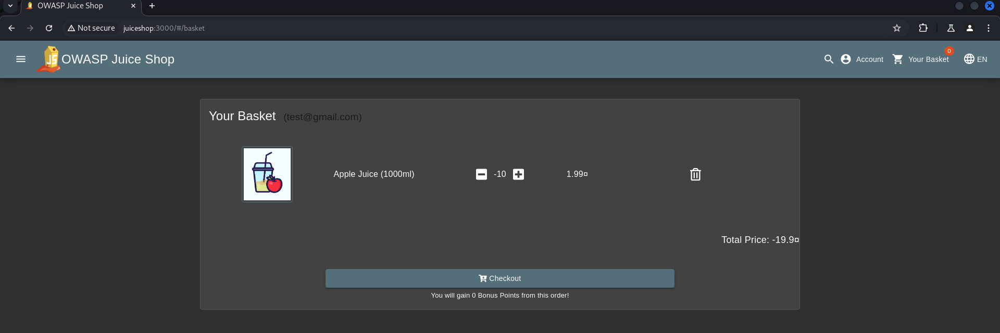
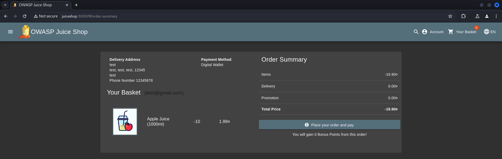
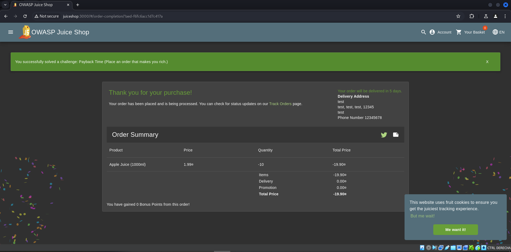
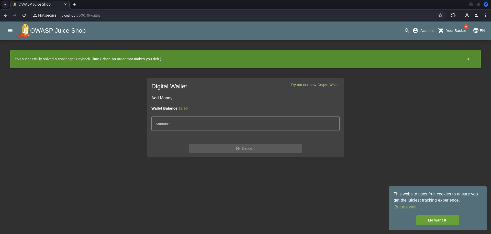

### Coordinación Red Team - Blue Team

**Resultados de Detección**:
| Ataque | Detectado | Tiempo de Detección |
|--------|-----------|---------------------|
| SQL Injection | [Sí/No] | [Tiempo] |
| XSS | [Sí/No] | [Tiempo] |
| Auth Bypass | [Sí/No] | [Tiempo] |
| Access Control | [Sí/No] | [Tiempo] |

### Screenshots

[Mínimo 12 screenshots]

### Verificación de Éxito
- [x] 3 reglas de detección configuradas
- [x] 4 vulnerabilidades explotadas
- [x] Alertas generadas
- [x] Dashboard de detecciones creado
- [x] 12 screenshots capturados
- [x] Vulnerabilidades con CVSS calculado

### Conceptos Aprendidos
1. **Reglas de Detección**: [Explica]

2. **SQL Injection**: SQL Injection (SQLi) es una vulnerabilidad que ocurre cuando una aplicación inserta directamente datos proporcionados por el usuario dentro de una consulta SQL sin sanitización ni validación adecuada.
Esto permite que un atacante inyecte código SQL malicioso, alterando la lógica original de la consulta.

3. **XSS**: Cross-Site Scripting (XSS) es una vulnerabilidad que permite a un atacante inyectar código JavaScript en una página vista por otros usuarios. Es posible cuando la aplicación refleja o almacena contenido del usuario sin escapar ni validar correctamente los caracteres especiales. En el XSS Reflejado, el payload vuelve inmediatamente en la respuesta. Se explota mediante enlaces maliciosos o parámetros manipulados.

4. **Improper Input Validation**: Ocurre cuando el backend no valida adecuadamente los datos, permitiendo valores absurdos, negativos, demasiado grandes, o formatos incorrectos.

5. **CVSS Scoring**: El Common Vulnerability Scoring System (CVSS) es un estándar internacional para medir la severidad de una vulnerabilidad. Evalúa varias métricas:
  - AV (Attack Vector): dónde puede explotarse (network, local, etc.).
  - AC (Attack Complexity): qué tan difícil es explotar.
  - PR (Privileges Required): si el atacante necesita autenticarse.
  - UI (User Interaction): si requiere acción de la víctima.
  - S (Scope): si se afecta otro componente distinto.
  - C (Confidentiality): impacto en confidencialidad.
  - I (Integrity): impacto en integridad.
  - A (Availability): impacto en disponibilidad.

6. **OWASP Top 10**: El OWASP Top 10 es una clasificación mantenida por OWASP que lista los diez riesgos más críticos de seguridad en aplicaciones web. Cada categoría agrupa vulnerabilidades comunes basadas en impacto, explotación y frecuencia en el mundo real.

---

## Análisis Técnico

### Arquitectura Completa del Sistema

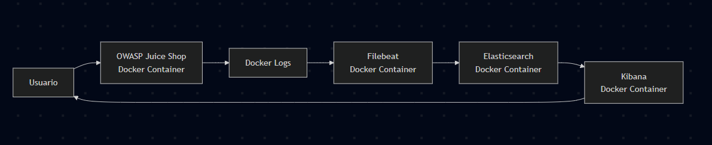

**Componentes**:
**Juice Shop**
Es la aplicación vulnerable que genera el tráfico y los eventos de seguridad. Corre dentro de un contenedor de Docker y expone un puerto HTTP (3000) al que se conectan los usuarios. Cada petición, error y acción de la aplicación se traduce en logs que luego son recolectados por Filebeat.

**Docker Engine**
Es la capa de orquestación que ejecuta y aísla los contenedores de Juice Shop, Elasticsearch, Kibana y Filebeat. Se encarga de crear las redes internas entre servicios, mapear los puertos hacia el host y almacenar los logs de cada contenedor para que puedan ser consumidos por otras herramientas.

**Filebeat**
Es el agente de recolección de logs (log shipper). Se ejecuta también en un contenedor y está configurado para leer los logs de los contenedores de Docker (especialmente Juice Shop). Normaliza la información, agrega metadatos (como nombre del contenedor, imagen, host, etc.) y envía los eventos a Elasticsearch.

**Elasticsearch**
Es el motor de búsqueda y almacenamiento de logs. Recibe los eventos enviados por Filebeat, los indexa y los hace consultables mediante su API REST. Permite almacenar grandes volúmenes de datos, realizar búsquedas avanzadas y servir como base para las visualizaciones y reglas de detección.

**Kibana**
Es la interfaz visual del sistema. Se conecta a Elasticsearch para consultar los índices de logs, mostrar dashboards, crear visualizaciones, ejecutar búsquedas KQL y administrar las reglas de detección (Security → Alerts & Rules). Es el punto de contacto principal para el “Blue Team”.

### Flujo de Datos Detallado

```
Usuario → Juice Shop → Docker Logs → Filebeat → Elasticsearch → Kibana
```

**Explicación paso a paso**:
1. El usuario envía peticiones HTTP (navegar, iniciar sesión, buscar productos, explotar vulnerabilidades, etc.) al contenedor de Juice Shop. Cada acción genera respuestas y eventos internos (errores, warnings, access logs).

2. Juice Shop escribe sus logs en stdout/stderr dentro del contenedor. Docker Engine captura esa salida y la almacena como logs del contenedor, etiquetándolos con información como el nombre del contenedor, ID, timestamps, etc.

3. Filebeat está configurado para leer los logs de los contenedores de Docker. Cada línea de log se transforma en un evento estructurado (JSON) al que se le agregan metadatos (container.name, image.name, host, labels, etc.). Estos eventos se agrupan y se envían de forma continua hacia Elasticsearch.

3. Al recibir los eventos desde Filebeat, Elasticsearch los almacena en índices específicos (por ejemplo, filebeat-juice-shop-*). Durante este proceso se analizan los campos, se aplican mappings y se optimiza la información para poder buscar por mensaje, contenedor, timestamp, IP, ruta, etc.

4. Kibana consulta los índices de Elasticsearch usando Data Views (por ejemplo, filebeat-*). A partir de estos datos se construyen visualizaciones (gráficos, tablas, métricas) y dashboards. Además, las reglas de detección ejecutan consultas periódicas sobre los logs para buscar patrones de ataque (SQLi, XSS, fuerza bruta, scanners, etc.) y generar alertas cuando se cumplen las condiciones definidas.

5. Cuando una alerta se dispara, el analista puede usar Kibana para inspeccionar el evento, revisar el contexto (IP de origen, ruta atacada, payload, usuario afectado) y tomar decisiones: bloquear una IP, ajustar reglas, o recomendar cambios en la aplicación. De esta forma, lo que comenzó como simples logs termina siendo una herramienta de detección y respuesta ante incidentes.

---

## Conclusiones

### Logros Principales

1. Se implementó exitosamente un sistema completo de monitoreo y observabilidad utilizando la pila ELK (Elasticsearch, Logstash y Kibana), con Filebeat como agente de recolección.

2. Se analizaron y visualizaron los logs generados por Juice Shop en tiempo real, permitiendo identificar patrones, errores y actividad relevante.

3. Se configuraron reglas de detección en Kibana que permitieron identificar ataques comunes como SQL Injection, XSS y fuerza bruta.

4. Se desarrolló un proceso de Red Team que identificó y explotó cuatro vulnerabilidades reales en Juice Shop, cada una documentada con pasos, payloads, impacto y CVSS.

5. Se integraron los resultados del Red Team y Blue Team para validar el funcionamiento del sistema de detección y visibilizar ataques reales.

### Reflexión Personal

Trabajar en este proyecto fue interesante porque combinó varias áreas: despliegue de servicios con Docker, análisis de seguridad ofensiva (Red Team), configuración de detecciones (Blue Team) y visualización de datos con Kibana. Algo que destacó fue ver cómo un sistema de monitoreo cobra sentido cuando se analiza tráfico real generado por vulnerabilidades explotadas manualmente. No solo se trató de levantar contenedores, sino de entender cómo fluye la información desde la aplicación hasta Elasticsearch y cómo se transforma en insights útiles para seguridad.

Una de las partes más desafiantes fue la sección de detecciones, ya que crear reglas que no generen demasiados falsos positivos requiere realmente entender el comportamiento de la aplicación y del tráfico legítimo. Fue interesante ver que muchas reglas sencillas funcionan, pero para ambientes reales sería necesario un nivel mucho más complejo de normalización, correlación y filtrado. Aun así, este proyecto permite visualizar cómo funciona un SOC a pequeña escala y cómo un analista puede responder ante ataques reales.

Finalmente, este trabajo deja una buena base de conocimientos aplicables de inmediato: comprensión de logging centralizado, arquitectura básica de ELK, principios de diseño de reglas de detección, y experiencia práctica explotando vulnerabilidades web comunes. En un entorno profesional, este tipo de habilidades son esenciales tanto para desarrolladores que desean construir aplicaciones más seguras como para equipos de seguridad que necesitan monitorear la actividad en tiempo real.

### Aplicaciones Prácticas

**En el mundo real, este sistema se podría usar para**:
1. Empresas con múltiples servicios distribuidos pueden unificar registros en una sola plataforma para facilitar auditorías, troubleshooting, seguimiento de errores y análisis de rendimiento. Esto reduce drásticamente el tiempo de respuesta frente a fallas operativas.

2. Con reglas como las creadas para SQL Injection, XSS y fuerza bruta, un SOC puede identificar intentos de intrusión en tiempo real. Implementar dashboards y alertas permite detectar patrones sospechosos antes de que se conviertan en incidentes mayores.

3. Los logs históricos almacenados en Elasticsearch permiten reconstruir lo ocurrido durante un ataque: rutas accedidas, payloads utilizados, usuarios comprometidos y origen del tráfico. Esto facilita la respuesta a incidentes y fortalece controles futuros.

3. El proceso de Red Team aplicado en Juice Shop es equivalente al que realizaría un equipo interno para evaluar la robustez de un sistema. Usar ELK permite ver cómo reaccionan los sistemas de detección y qué brechas aún existen.

4. Industrias reguladas (finanzas, salud, telecomunicaciones) requieren mantener registros detallados de eventos y accesos. Un sistema ELK bien configurado ayuda a cumplir estándares como ISO 27001, PCI-DSS, GDPR o HIPAA.

5. Además de seguridad, ELK puede integrarse con métricas, trazas y logs para monitorear la salud general de una aplicación. Esto permite identificar cuellos de botella, tiempos de respuesta lentos o servicios que fallan con frecuencia.

### Habilidades Desarrolladas

- [x] Administración de contenedores Docker
- [x] Configuración de sistemas de logging
- [x] Análisis de logs de seguridad
- [x] Creación de visualizaciones de datos
- [x] Detección de amenazas
- [x] Explotación de vulnerabilidades (ético)
- [x] Documentación técnica
- [x] Troubleshooting

---

## Anexos

### Anexo A: Reglas de Detección (JSON)

```json
{"id":"e50ef170-ca33-11f0-9a1c-8bff4fefb87e","updated_at":"2025-11-25T19:21:09.312Z","updated_by":"elastic","created_at":"2025-11-25T19:21:09.312Z","created_by":"elastic","name":"SQL Injection Detection - Nginx","tags":["SQL Injection","Web Attack","OWASP"],"interval":"1m","enabled":true,"revision":0,"description":"Detecta patrones de SQL Injection en request_uri de nginx","risk_score":80,"severity":"high","output_index":"","author":[],"false_positives":[],"from":"now-2m","rule_id":"detect-sqli-002","max_signals":100,"risk_score_mapping":[],"severity_mapping":[],"threat":[],"to":"now","references":[],"version":1,"exceptions_list":[],"immutable":false,"related_integrations":[],"required_fields":[],"setup":"","type":"query","language":"kuery","index":["filebeat-nginx-access-*"],"query":"request_uri: (*OR* or *UNION* or *SELECT* or *INSERT* or *DROP* or *--* or *%27* or *1=1*)","actions":[]}

{"id":"d65252d0-ca4c-11f0-88b4-171c166119f3","updated_at":"2025-11-25T22:19:42.025Z","updated_by":"elastic","created_at":"2025-11-25T22:19:42.025Z","created_by":"elastic","name":"Security Scanner Detection","tags":["Scanner","Reconnaissance","Automated Attack"],"interval":"1m","enabled":true,"revision":0,"description":"Detecta tráfico de herramientas de escaneo (sqlmap, nmap, burp, nikto, etc)","risk_score":60,"severity":"medium","output_index":"","author":[],"false_positives":[],"from":"now-2m","rule_id":"detect-scanner-001","max_signals":100,"risk_score_mapping":[],"severity_mapping":[],"threat":[],"to":"now","references":[],"version":1,"exceptions_list":[],"immutable":false,"related_integrations":[],"required_fields":[],"setup":"","type":"query","language":"kuery","index":["filebeat-nginx-access-*"],"query":"http_user_agent: (*sqlmap* or *nmap* or *burp* or *nikto* or *python-requests* or *Nuclei* or *masscan* or *ZAP* or *Acunetix* or *Nessus*)","actions":[]}

{"id":"e73a92f0-ca52-11f0-88b4-171c166119f3","updated_at":"2025-11-25T23:03:07.725Z","updated_by":"elastic","created_at":"2025-11-25T23:03:07.725Z","created_by":"elastic","name":"Command Injection Detection","tags":["Command Injection","Web Attack","RCE"],"interval":"1m","enabled":true,"revision":0,"description":"Detecta intentos de command injection en URLs","risk_score":90,"severity":"critical","output_index":"","author":[],"false_positives":[],"from":"now-2m","rule_id":"detect-cmdinj-001","max_signals":100,"risk_score_mapping":[],"severity_mapping":[],"threat":[],"to":"now","references":[],"version":1,"exceptions_list":[],"immutable":false,"related_integrations":[],"required_fields":[],"setup":"","type":"query","language":"kuery","index":["filebeat-nginx-access-*"],"query":"request_uri.keyword: *%3B* or request_uri.keyword: *%7C* or request_uri.keyword: *%60*","actions":[]}
{"id":"b58e9460-ca50-11f0-88b4-171c166119f3","updated_at":"2025-11-25T22:47:24.337Z","updated_by":"elastic","created_at":"2025-11-25T22:47:24.337Z","created_by":"elastic","name":"Brute Force Login Detection","tags":["Brute Force","Authentication","OWASP"],"interval":"1m","enabled":true,"revision":0,"description":"Detecta múltiples intentos fallidos de login en Juice Shop","risk_score":70,"severity":"high","output_index":"","author":[],"false_positives":[],"from":"now-2m","rule_id":"detect-bruteforce-001","max_signals":100,"risk_score_mapping":[],"severity_mapping":[],"threat":[],"to":"now","references":[],"version":1,"exceptions_list":[],"immutable":false,"related_integrations":[],"required_fields":[],"setup":"","type":"threshold","language":"kuery","index":["filebeat-nginx-access-*"],"query":"request_uri: \"/rest/user/login\" and status: 401","threshold":{"field":["remote_addr.keyword"],"value":5},"actions":[]}

{"id":"cc8ca520-ca4c-11f0-88b4-171c166119f3","updated_at":"2025-11-25T22:19:24.803Z","updated_by":"elastic","created_at":"2025-11-25T22:19:24.803Z","created_by":"elastic","name":"XSS Attack Detection","tags":["XSS","Web Attack","OWASP Top 10"],"interval":"1m","enabled":true,"revision":0,"description":"Detecta payloads sospechosos de XSS en URLs y mensajes","risk_score":75,"severity":"high","output_index":"","author":[],"false_positives":[],"from":"now-2m","rule_id":"detect-xss-001","max_signals":100,"risk_score_mapping":[],"severity_mapping":[],"threat":[],"to":"now","references":[],"version":1,"exceptions_list":[],"immutable":false,"related_integrations":[],"required_fields":[],"setup":"","type":"query","language":"kuery","index":["filebeat-nginx-access-*","filebeat-juice-shop-*"],"query":"request_uri:(*%3Cscript* or *%3Cimg* or *javascript* or *onerror* or *alert*)","actions":[]}

{"exported_count":5,"exported_rules_count":5,"missing_rules":[],"missing_rules_count":0,"exported_exception_list_count":0,"exported_exception_list_item_count":0,"missing_exception_list_item_count":0,"missing_exception_list_items":[],"missing_exception_lists":[],"missing_exception_lists_count":0,"exported_action_connector_count":0,"missing_action_connection_count":0,"missing_action_connections":[],"excluded_action_connection_count":0,"excluded_action_connections":[]}
```

### Anexo B: Dashboard Export

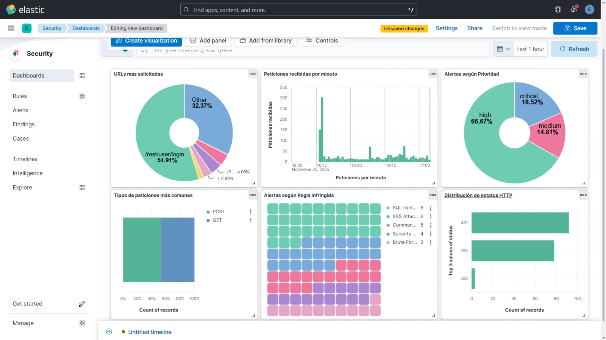

---

## Estadísticas del Proyecto

- **Total de Screenshots**: 58 (mínimo 42)
- **Total de Comandos Ejecutados**: 31
- **Total de Vulnerabilidades Explotadas**: 4
- **Total de Reglas de Detección**: 3
- **Total de Visualizaciones Creadas**: 3
- **Total de Dashboards Creados**: 2
- **Tiempo Total Invertido**: 6.16 horas

---

## Checklist de Entrega

### Documentación
- [x] Reporte completo
- [x] Todos los pasos documentados
- [x] Screenshots de calidad
- [x] Comandos con outputs
- [x] Problemas explicados

### Red Team
- [x] 4 vulnerabilidades explotadas
- [x] Cada una con PoC completo
- [x] CVSS calculado
- [x] OWASP Top 10 clasificación

### Blue Team
- [x] 3 reglas configuradas
- [x] Alertas funcionando
- [x] Dashboard de detecciones
- [x] Informe de respuesta

### Archivos
- [x] reporte-final.pdf o .md
- [x] screenshots/ organizado
- [ ] comandos.txt
- [x] reglas-deteccion.json
- [x] dashboard-export.ndjson

---

**Fin del Reporte**

**Fecha de Entrega**: 25 de noviembre de 2025  
**Firma**: Pablo Zamora, Diego Aquino y Erick Guerra
