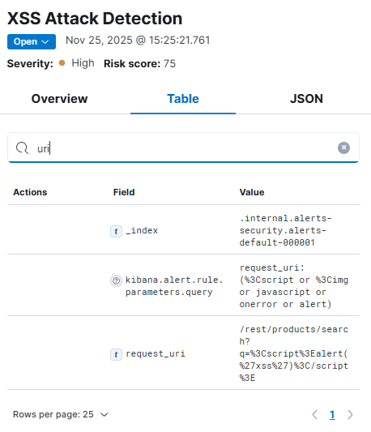
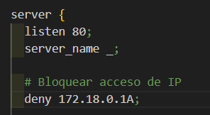
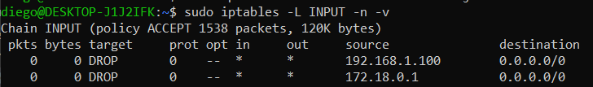

# Reporte de alerta de seguridad



## Resumen de la alerta

- Tipo de ataque: XSS (Cross-Site Scripting)
- Regla que generó la alerta: `XSS Attack Detection` (`detect-xss-001`)
- Severidad: alta
- Puntaje de riesgo: 75
- Origen: Nginx proxy (`service.name: nginx-proxy`)
- Entorno: `lab`
- Equipo afectado: `e0cd629dc200` (Ubuntu 20.04.6 LTS)
- Estado de la alerta: activa / abierta

## Detalle del evento

- Fecha y hora del evento original (`@timestamp`): `2025-11-25T21:25:21.761Z`
- Fecha y hora del log original (`signal.original_time`): `2025-11-25T21:25:00.000Z`
- IP origen (cliente hacia el proxy): `172.18.0.1`
- IP/puerto del upstream (backend): `172.18.0.2:3000`
- User-Agent: `PostmanRuntime/7.49.1`
- Método HTTP: `GET`
- Código de respuesta HTTP: `500`
- Tiempo de respuesta upstream: `0.030` s
- Bytes enviados en la respuesta: `990`
- Archivo de log: `/var/log/nginx/juice_access.log`

### Request

- `request` completo:  
  `GET /rest/products/search?q=%3Cscript%3Ealert(%27xss%27)%3C/script%3E HTTP/1.1`

- `request_uri`:  
  `/rest/products/search?q=%3Cscript%3Ealert(%27xss%27)%3C/script%3E`

Decodificado, el parámetro `q` contiene:

```text
<script>alert('xss')</script>
```

Esto corresponde a un intento de inyección de JavaScript en el parámetro de búsqueda, típico de un ataque de Cross-Site Scripting (XSS).

## Motivo de disparo de la regla

La regla de detección es una **Custom Query Rule** de tipo `query` sobre índices `filebeat-nginx-access-*`, con esta condición:

```text
request_uri:(%3Cscript or %3Cimg or javascript or onerror or alert)
```

El `request_uri` del evento incluye `%3Cscript` (que es `<script` URL-encoded), por lo que **coincide con el patrón de la regla** y genera la alerta de tipo XSS.

## Información de la regla

- Nombre de la regla: `XSS Attack Detection`
- Descripción: `Detecta payloads sospechosos de XSS en URLs y mensajes`
- Tipo: `query`
- Lenguaje: `kuery`
- Índices monitoreados: `filebeat-nginx-access-*`
- Severidad: `high`
- Riesgo: `75`
- Intervalo de ejecución: `1m`
- Ventana de búsqueda: `from: now-120s` a `to: now`
- Tags: `XSS`, `Web Attack`, `OWASP Top 10`

## Acciones recomendadas

### 1. Bloqueo de IP ofensora a nivel de Nginx

Agregar una directiva `deny` en la configuración de Nginx para la IP atacante:


```nginx
# Bloqueo de IP atacante identificada
deny 172.18.0.1;
```


Recargar la configuración de Nginx después del cambio:

```bash
sudo nginx -t
sudo systemctl reload nginx
```

### 2. Bloqueo temporal a nivel de firewall (iptables)

Bloquear el tráfico desde la IP atacante en el host que corre Nginx:

```bash
sudo iptables -A INPUT -s 172.18.0.1 -j DROP
```

